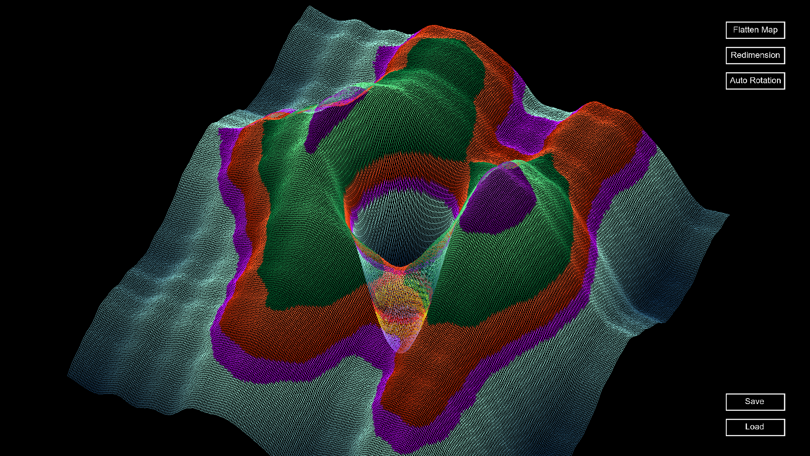

**My World: A 2D Height Map Editor with Synthwave Graphics and Music**

**Overview**
My World is a program designed for generating, editing, and rendering 2D height maps in 3D, featuring stunning synthwave graphics and music. This README provides instructions on how to run the project and navigate through the program's various functionalities.

**Installation**
To run the project, follow these steps:

1. Run `make` to compile the necessary files.
2. Execute the program by running `./my_world`.

**Controls**
The program provides multiple control options for ease of use. You can choose between the following input methods:

* Mouse Control:
  * Left-click: Move the camera.
  * Right-click: Rotate the camera.
  * Mouse wheel: Zoom in or out.
* Keyboard Control:
  * Arrow keys or [ZQSD]: Move the camera.
  * [P]: Rotate the camera.
  * [M]: Zoom in or out.

**Editor Mode**
Press the [E] key to enter the editor mode. In this mode, you can modify the terrain using the following controls:

* Terrain Editing:
  * Left-click: Increase the terrain height.
  * Right-click: Decrease the terrain height.
  * [I]: Increase the pen strength.
  * [K]: Decrease the pen strength.
  * Mouse wheel: Adjust the pen size.

**Map Manipulation**
The program provides additional functionality for manipulating the map:

* [R]: Generate a new map.
* [B]: Flatten the terrain.

**Menu Options**
Various menu options are available for customizing the program's appearance and settings:

* [H]: Hide the menu and switch to full-screen mode.
* Autorotation:
  * Left-click: Enable left rotation.
  * Right-click: Enable right rotation.
* Redimension:
  * Click on the button and enter the desired X and Z sizes to resize the map.
* Save and Load:
  * Click on the respective buttons and enter a file path to save or load a height map.

 **Note** : Ensure that the height map files are in a compatible format (e.g., PNG, TIFF) for successful loading.

**Enjoy exploring your synthwave-inspired 3D height maps in My World!**

